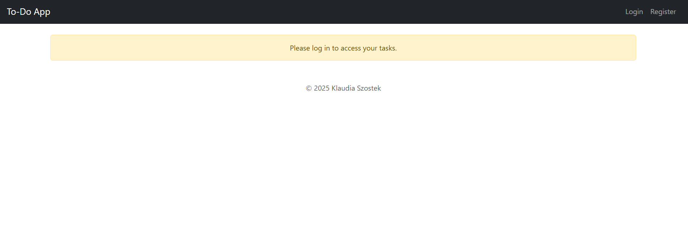
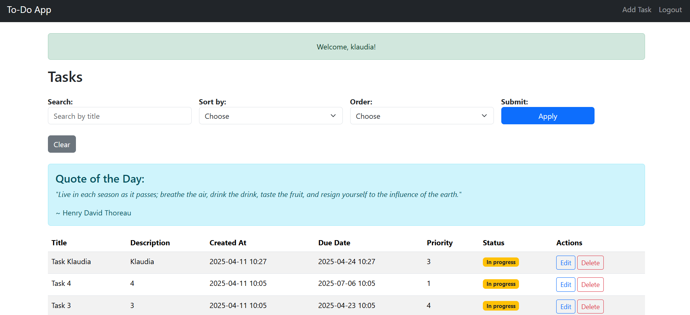
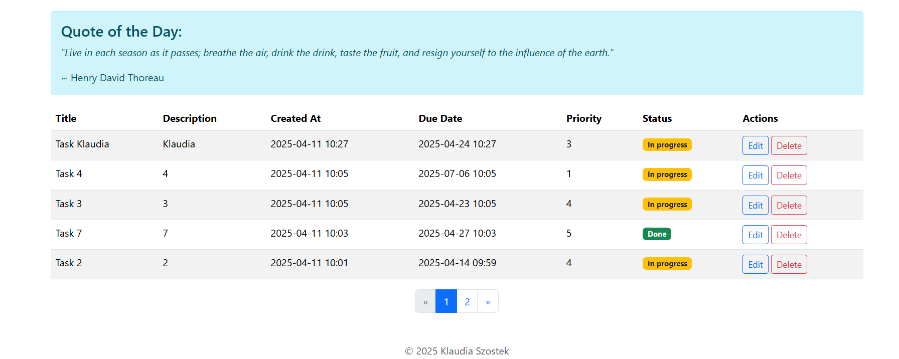

# TodoApp

The To-Do App is a web application developed in Python using the Flask framework and styled with the Bootstrap CSS framework. This project aims to provide users with a simple interface to manage their tasks. It allows users to add, edit, delete, and track their to-do list items. Additionally, it features task categorization and a priority system to improve task management.

## Key Features

Task Management: Users can add, update, and delete tasks.
Task Priority: Each task can be assigned a priority.
Task Categories: Tasks can be grouped into categories.
User Authentication: Users can register, log in, and manage their task lists securely.
Database Integration: All tasks are stored in a relational database using SQLAlchemy.

## Technologies Used

Flask: Web application framework.
SQLAlchemy: ORM for database management.
Bootstrap: CSS framework for styling.

## Installation and Setup

Requirements:

- Python 3.13.1+
- Pip
- Virtualenv (optional but recommended)

### Installation:

Clone the repository:

https://github.com/klaudiaszostek/TodoApp

Create and activate the virtual environment:

Windows:
> python -m venv venv
> .\venv\Scripts\activate

### Install the required dependencies:

> pip install -r requirements.txt

### Running the Application:

Start the server: 
> python run.py

Open your browser and go to: 
http://127.0.0.1:5000

## External API

https://zenquotes.io/api/random

## Screenshots

### Author
Klaudia Szostek

### License
This project is licensed under the MIT License. See the LICENSE file for details.

### Contact
If you have questions or issues, please contact:

Email: klaudiaszostek44@gmail.com

